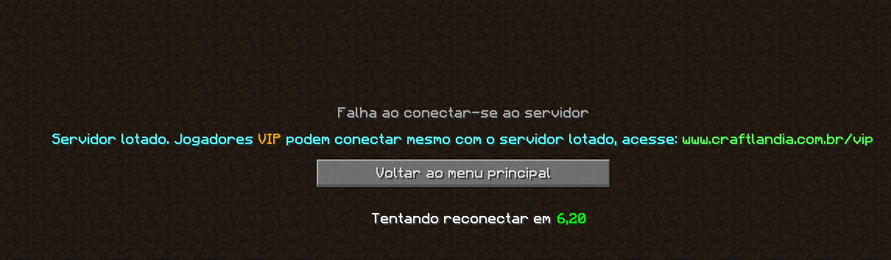
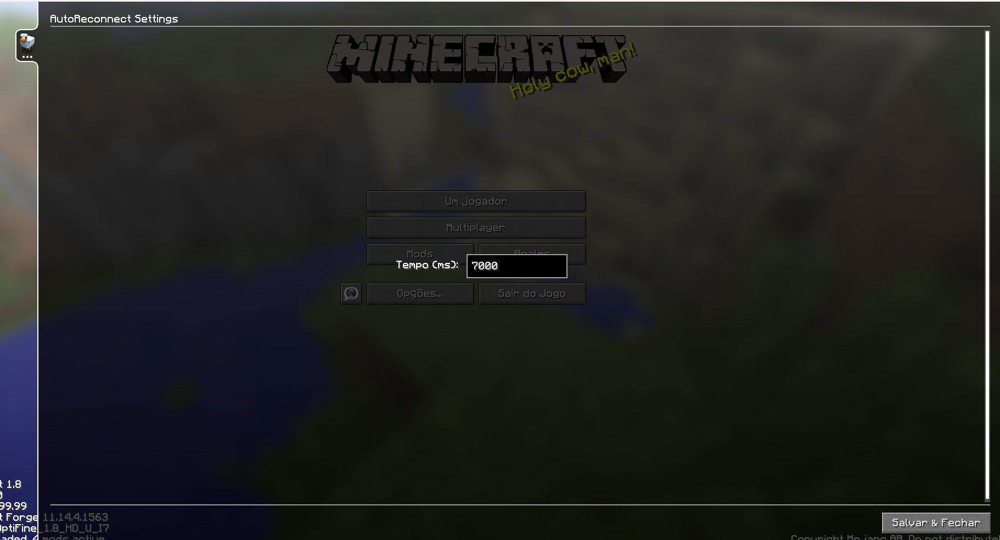

# AutoReconnect Litemod - Minecraft 1.8
Este é um simples litemod para Minecraft, que faz com que o player se reconecte ao servidor se for desconectado enquanto joga.  
O mod exibe um contador regressivo na tela de disconnect. Quando o contador é zerado, o mod tenta se reconectar ao servidor.  
O tempo entre tentativas é configurável pelas configurações do liteloader, e é salvo em **liteconfig/common/AutoReconnect.json** 

Necessário:  
- Minecraft 1.8  
- Liteloader
  
Instalação:  
1. Baixe o arquivo [.litemod](https://github.com/lomexicano/AutoReconnect-litemod-Minecraft-1.8/releases/tag/mod)  
2. Coloque na pasta .minecraft/mods
3. Se você tiver o liteloader instalado, ele será carregado e já estará funcionando ao iniciar o jogo.
  

